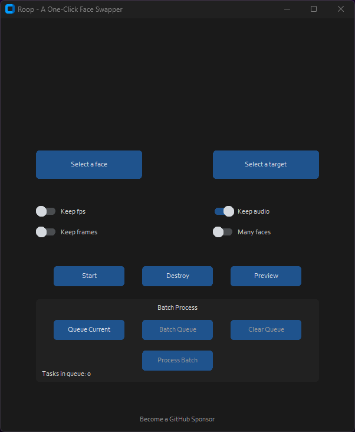

This repository is a fork of the original [Project](https://github.com/s0md3v/roop), enriched with extended features to enhance its functionality.
Key additions include:
- **Batch Processing and Queue Management:** Users can now add tasks to a queue, process them in batches, and manage the queue efficiently. The process has been streamlined with integrated auto-naming for output files. What's more, the queue persists over sessions as it's based on an SQLite database. This allows users to add tasks, close the program, and return later to process the batch transformations.
- **Removal of NSFW Lock:** The NSFW lock imposed by the original project has been removed to provide users with unrestricted access (see [Disclaimer](#disclaimer) below).

Please note: This fork is a passion project. While I'm thrilled about these enhancements and eager to share them with the community, I may not be in a position to offer long-term maintenance and support. Despite this, I strongly encourage users and fellow developers to contribute and keep this project active and beneficial.

Lastly, while significant changes have been made, I wish to fully acknowledge the original work done in Project Roop. For information on the original functionalities and documentation, please refer back to Project Roop.

## Brief Description

Take a video and replace the face in it with a face of your choice. You only need one image of the desired face. No dataset, no training.

You can watch some demos [here](https://drive.google.com/drive/folders/1KHv8n_rd3Lcr2v7jBq1yPSTWM554Gq8e?usp=sharing).
A StableDiffusion extension is also available, [here](https://github.com/s0md3v/sd-webui-roop).

<p align="center"></p>

## About Batch Processing 


## How do I install it?

**Issues regarding installation will be closed from now on, we cannot handle the amount of requests.**

- **Basic:** It is more likely to work on your computer but it will also be very slow. You can follow instructions for the basic install [here](https://github.com/s0md3v/roop/wiki/1.-Installation).

- **Acceleration:** If you have a good GPU and are ready for solving any software issues you may face, you can enable GPU which is wayyy faster. To do this, first follow the basic install instructions given above and then follow GPU-specific instructions [here](https://github.com/s0md3v/roop/wiki/2.-Acceleration).


## How do I use it?
> Note: When you run this program for the first time, it will download some models ~300MB in size.

Executing `python run.py` command will launch this window:

<p align="center"></p>

Choose a face (image with desired face) and the target image/video (image/video in which you want to replace the face) and click on `Start`. Open file explorer and navigate to the directory you select your output to be in. You will find a directory named `<video_title>` where you can see the frames being swapped in realtime. Once the processing is done, it will create the output file. That's it.

Additional command line arguments are given below. To learn out what they do, check [this guide](https://github.com/s0md3v/roop/wiki/Advanced-Options).


```
options:
  -h, --help            show this help message and exit
  -s SOURCE_PATH, --source SOURCE_PATH
                        select an source image
  -t TARGET_PATH, --target TARGET_PATH
                        select an target image or video
  -o OUTPUT_PATH, --output OUTPUT_PATH
                        select output file or directory
  --frame-processor {face_swapper,face_enhancer} [{face_swapper,face_enhancer} ...]
                        pipeline of frame processors
  --keep-fps            keep original fps
  --keep-audio          keep original audio
  --keep-frames         keep temporary frames
  --many-faces          process every face
  --video-encoder {libx264,libx265,libvpx-vp9}
                        adjust output video encoder
  --video-quality VIDEO_QUALITY
                        adjust output video quality
  --max-memory MAX_MEMORY
                        maximum amount of RAM in GB
  --execution-provider {cpu,...} [{cpu,...} ...]
                        execution provider
  --execution-threads EXECUTION_THREADS
                        number of execution threads
  -v, --version         show program's version number and exit
```

Looking for a CLI mode? Using the -s/--source argument will make the run program in cli mode.


## Disclaimer
This software is a tool designed to contribute productively to the rapidly growing AI-generated media industry. It can aid artists with tasks such as animating a custom character or using the character as a model for clothing etc.

While this fork has removed the explicit filter that was previously included, it is intended for legitimate and ethical uses. Users of this software are expected to employ this tool responsibly and in accordance with all applicable local laws and ethical guidelines. In cases where the face of a real person is being used, users are strongly encouraged to obtain explicit consent from the concerned individual, and to clearly state that the resulting media is a deepfake when posting content online.

The developers of this software bear no responsibility for the actions of end-users. This tool is provided 'as is', without warranty of any kind, express or implied. It is the responsibility of the user to ensure their use of this software complies with all legal and ethical standards.

By using this software, you acknowledge and accept these conditions and accept all responsibility for your actions. Any misuse or harm caused by the use of this software is solely the responsibility of the user.


## Credits
- [Somdev](https://github.com/s0md3v): the original author of the project. 
- [henryruhs](https://github.com/henryruhs): for being an irreplaceable contributor to the project.
- [ffmpeg](https://ffmpeg.org/): for making video related operations easy.
- [deepinsight](https://github.com/deepinsight): for their [insightface](https://github.com/deepinsight/insightface) project which provided a well-made library and models.
- and all developers behind libraries used in this project.
